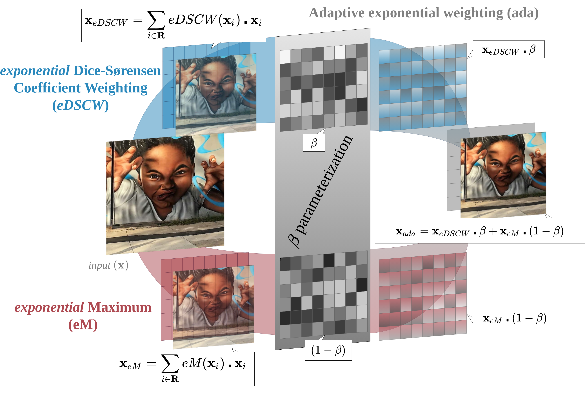
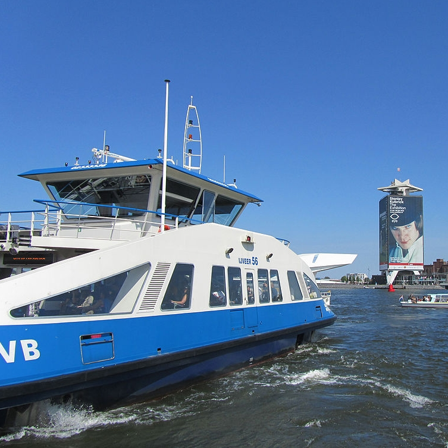

# AdaPool: Exponential Adaptive Pooling for Information-Retaining Downsampling


--------------------------------------------------------------------------------
## Abstract
Pooling layers are essential building blocks of convolutional neural networks (CNNs), to reduce computational overhead and increase the receptive fields of proceeding convolutional operations. Their goal is to produce downsampled volumes that closely resemble the input volume while, ideally, also being computationally and memory efficient. Meeting both these requirements remains a challenge. To this end, we propose an adaptive and exponentially weighted pooling method: adaPool. Our method learns a regional-specific fusion of two sets of pooling kernels that are based on the exponent of the DiceSørensen coefficient and the exponential maximum, respectively. AdaPool improves the preservation of detail on a range of tasks including image and video classification and object detection. A key property of adaPool is its bidirectional nature. In contrast to common pooling methods, the learned weights can also be used to upsample activation maps. We term this method adaUnPool. We evaluate adaUnPool on image and video super-resolution and frame interpolation. For benchmarking, we introduce Inter4K, a novel high-quality, high frame-rate video dataset. Our experiments demonstrate that adaPool systematically achieves better results across tasks and backbones, while introducing a minor additional computational and memory overhead. <p align="center">

<p align="center">

</p>

<i></i>
<br>
<p align="center">
<a href="https://ieeexplore.ieee.org/abstract/document/9982650" target="blank" >[IEEExplore link]</a>&nbsp;&nbsp;
<a href="https://arxiv.org/abs/2111.00772" target="blank" >[arXiv preprint]</a>
</p>


|Original|||||||
|:-----:|:-----:|:-----:|:-----:|:-----:|:-----:|:-----:|
|adaPool|||||||


## Dependencies
All parts of the code assume that `torch` is of version 1.8 or higher. There might be instability issues on previous versions.

This work relies on the previous repo for exponential maximum pooling (**[alexandrosstergiou/SoftPool](https://github.com/alexandrosstergiou/SoftPool)**). Before opening an issue please do have a look at that repository as common problems in running or installation have been addressed.

> ***! Disclaimer:*** This repository is heavily structurally influenced on Ziteng Gao's LIP repo [https://github.com/sebgao/LIP](https://github.com/sebgao/LIP)

### (Optional pre-installation step)

Some building issues can be resolved by using older gcc/g++ versions:
```
$ sudo apt install gcc-10 g++-10
$ export CC=/usr/bin/gcc-10
$ export CXX=/usr/bin/g++-10
```

## Installation

You can build the repo through the following commands:
```
$ git clone https://github.com/alexandrosstergiou/adaPool.git
$ cd adaPool/pytorch
$ make install
--- (optional) ---
$ make test
```


## Usage

You can load any of the 1D, 2D or 3D variants after the installation with:

```python
# Ensure that you import `torch` first!
import torch
import adapool_cuda

# For function calls
from adaPool import adapool1d, adapool2d, adapool3d, adaunpool
from adaPool import edscwpool1d, edscwpool2d, edscwpool3d
from adaPool import empool1d, empool2d, empool3d
from adaPool import idwpool1d, idwpool2d, idwpool3d

# For class calls
from adaPool import AdaPool1d, AdaPool2d, AdaPool3d
from adaPool import EDSCWPool1d, EDSCWPool2d, EDSCWPool3d
from adaPool import EMPool1d, EMPool2d, EMPool3d
from adaPool import IDWPool1d, IDWPool2d, IDWPool3d
```

+ `(ada/edscw/em/idw)pool<x>d`: Are functional interfaces for each of the respective pooling methods.
+ `(Ada/Edscw/Em/Idw)Pool<x>d`: Are the class version to create objects that can be referenced in the code.

## Citation

```
@article{stergiou2022adapool,
  author={Stergiou, Alexandros and Poppe, Ronald},
  journal={IEEE Transactions on Image Processing}, 
  title={AdaPool: Exponential Adaptive Pooling for Information-Retaining Downsampling}, 
  year={2023},
  volume={32},
  pages={251-266},
  doi={10.1109/TIP.2022.3227503}}
```

## Licence

MIT
